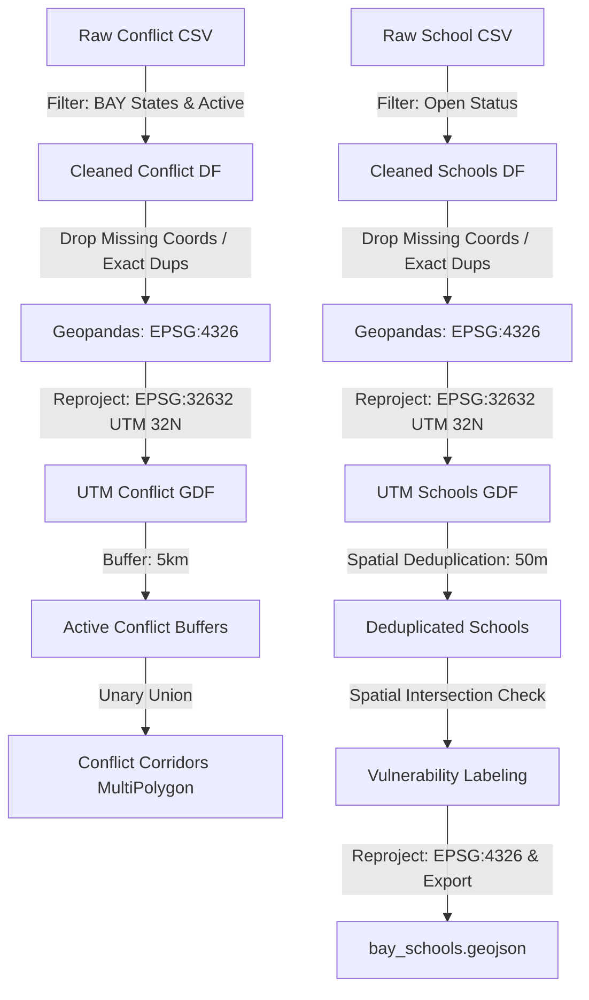

# EBI: BAY States Educational Access & Conflict Tracker
### Strategic GIS Framework & Repository Guide

---

## 1. Context & Objectives

The conflict in Northeast Nigeria—predominantly affecting the states of **Borno, Adamawa, and Yobe (BAY)**—has entered its second decade, causing unprecedented disruptions to civilian life and critical public infrastructure. Educational institutions have frequently been targeted or compromised, resulting in a systemic collapse of formal schooling.

The primary objective of this project is to model the spatial intersection of active conflict events and educational facilities. By mapping **active conflict corridors**, we expose "invisible educational deserts"—geographic areas where schools remain technically registered but are operationally inaccessible due to their proximity to ongoing violence. 

Through this tracker, the **Education in Emergencies (EiE) Working Group** and the **Evidence-Based Intervention (EBI) management team** can transition from reactive responses to proactive, spatial-first operational planning.

---

## 2. Technical Methodology

To ensure high-fidelity spatial analysis, our data engineering pipeline combines raw registry datasets with temporal conflict logs using a strict geographic processing sequence.



### Data Cleansing & Ground-Truth Verification
*   **Status Filtering**: The school registry contains active, closed, and unverified facilities. We extract strictly `School Status = Open` records to ensure we do not map abandoned structures.
*   **Coordinate Integrity**: Records missing critical spatial headers (`latitude`, `longitude`) are systematically dropped.
*   **Name Corrections**: We sanitize common spelling discrepancies and typos across state, LGA, and facility name fields (e.g., standardizing Girei and Tamuwa).

### Spatial Deduplication (50-Meter Radius)
Registry data frequently suffers from "duplicate coordinate bloat"—multiple administrative rows registered to a single school compound coordinates. We apply a greedy spatial index querying algorithm to deduplicate facilities. If multiple school records fall within a **50-meter radius** of each other, we retain the primary record and prune redundant entries to protect map display performance and statistical accuracy.

### Projected Coordinate Reference System (CRS)
All coordinates are recorded initially in **EPSG:4326 (WGS 84)**. For accurate distance calculations, both datasets are reprojected into **EPSG:32632 (WGS 84 / UTM Zone 32N)**. This UTM zone is the standard metric projection for western/central Nigeria, allowing us to perform precise meter-based calculations rather than relying on degree-based approximations.

### The 5km Conflict Buffer & Corridors
We create a **5-kilometer buffer** around each active conflict point. The 5km threshold corresponds to the standard operational reach of localized violence and the maximum walking distance considered safe for children in conflict zones. 
Using a **Unary Union** operation, overlapping buffers are dissolved into unified **"conflict corridors"**. This prevents overlapping calculations and creates clear polygon zones representing high-risk areas.

---

## 3. Data Dictionary (Processed GeoJSON Schema)

The final exported dataset (`data/processed/bay_schools.geojson`) is projected in EPSG:4326 and contains the following attribute schema:

| Property Name | Data Type | Description | Example Value |
| :--- | :--- | :--- | :--- |
| `id` | String | Unique identifier of the school facility in the database | `"u_fc_poi_school.101"` |
| `School Name` | String | Cleaned, standardized official name of the school | `"Government Secondary School, Girei"` |
| `School Level` | String | Academic classification of the institution | `"Junior Secondary"` |
| `School Type` | String | Management/operational type of the school | `"Regular"` |
| `state_name` | String | State jurisdiction (Borno, Adamawa, or Yobe) | `"Adamawa"` |
| `ward_code` | String | Official administrative ward code | `"ADSGRE05"` |
| `longitude` | Float | Longitude coordinate in decimal degrees (WGS84) | `12.552512` |
| `latitude` | Float | Latitude coordinate in decimal degrees (WGS84) | `9.363946` |
| `vulnerability` | String | Calculated threat rating based on corridor intersection | `"High"` / `"Low"` |
| `accessibility` | String | Access rating derived from vulnerability status | `"Inaccessible"` / `"Accessible"` |

---

## 4. Operational Action Tiers

To translate spatial intelligence into field action, EBI management utilizes the following guide linking school vulnerability and accessibility classifications to immediate interventions:

| Threat Tier | Map Color | Description | Field Intervention Strategy |
| :--- | :--- | :--- | :--- |
| **High Vulnerability**<br>*(Inaccessible)* | **Red** | School falls within an active 5km conflict corridor. High risk of physical attacks, landmines, or active skirmishes. | **1. Suspend Static Operations**: Halt physical school operations immediately.<br>**2. Deploy Mobile Learning Spaces (MLSs)**: Set up temporary learning tents in nearby low-vulnerability hub communities.<br>**3. Activate Radio/Distance Learning**: Distribute solar-powered radios and pre-recorded curriculum booklets to families. |
| **Low Vulnerability**<br>*(Accessible)* | **Green** | School is outside current conflict corridors. Normal operational access is possible, but vigilance is required. | **1. Maintain Classroom Learning**: Continue formal, in-person curriculum delivery.<br>**2. Establish Safe Corridors**: Coordinate community-led watch committees to secure child walking routes.<br>**3. Implement Early Warning Systems**: Train teachers on security drills and link the school with local humanitarian alert networks. |

---

## 5. Repository Guide

### Directory Structure
```directory
├── data/
│   ├── raw/
│   │   ├── nga_bay_schools_with_status.csv   # Raw school registry dataset
│   │   ├── conflict_data_nga.csv             # Raw UCDP/ACLED conflict events
│   │   └── nga_shp/                           # Administrative boundary shapefiles
│   └── processed/
│       └── bay_schools.geojson                # Output processed spatial dataset
├── docs/
│   ├── index.html                             # Dashboard frontend
│   └── app.js                                 # Map and interactive control script
├── process_data.py                            # Python data engineering script
└── README.md                                  # Strategy guide (this document)
```

### Running the Data Pipeline
Execute the Python script to clean the raw data, perform the spatial buffering/union, assign vulnerability status, and generate the final GeoJSON layer:
```bash
python3 process_data.py
```

### Viewing the Dashboard
Start a local HTTP server from the project root:
```bash
python3 -m http.server 8000
```
Open your browser and navigate to `http://localhost:8000/docs/index.html`.
